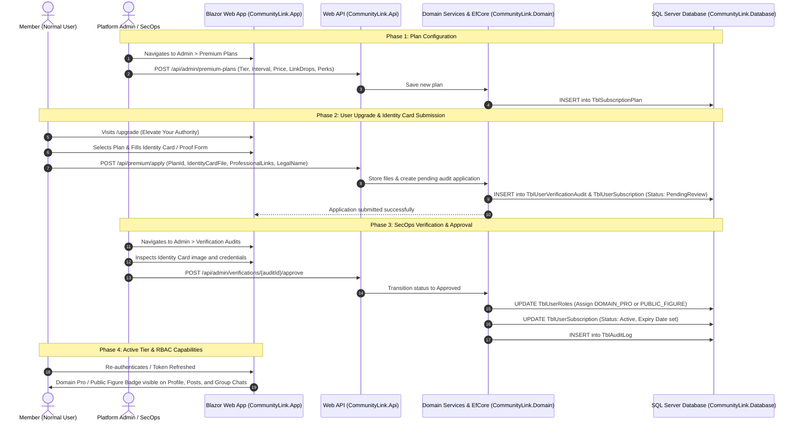

# Implementation Plan: PermiumFeatures

## 1. Executive Summary & Objective
Implement a multi-tier **Premium Upgrade & Verification System** on CommunityLink that enables normal members (`USER` / `MEMBER`) to upgrade their platform standing to:
1. ⭐ **Domain Professional** (`DOMAIN_PRO` / `DOMAIN_PROFESSIONAL`)
2. 🏛️ **Public Figure** (`PUBLIC_FIGURE`)

The system comprises:
- **Admin Configuration Portal**: Dynamically configure subscription plans (tier, billing intervals, monetary pricing in USD/MMK, LinkDrop point equivalents, and perks).
- **Public & Member Upgrade Showcase Page**: 3-column pricing card layout, billing cycle toggle (Monthly vs Annual), verification audit workflow tracker, feature comparison matrix, and FAQ accordion (derived from the provided design reference).
- **Identity Verification & Credential Intake**:
  - Domain Professional: Work email, professional links (LinkedIn, GitHub), domain credentials, or portfolio proofs.
  - Public Figure: Government-issued Identity Card / Official ID upload, legal name validation, and public presence documentation.
- **Admin Verification & SecOps Review Queue**: Dedicated admin interface to inspect submitted Identity Cards/proofs, approve or reject applications with feedback, and toggle auto-assigned RBAC roles.
- **Subscription Lifecycle & Expiration**: Tracks active subscription intervals with automatic role degradation to `USER` upon plan expiration.

---

## 2. Architecture Overview & Data Flow

---

## 3. Database Schema Design (`CommunityLink.Database`)

### A. `TblSubscriptionPlan` (Admin-configured Plans)
| Column | Type | Constraints / Description |
| :--- | :--- | :--- |
| `PlanId` | `INT IDENTITY(1,1)` | Primary Key |
| `TargetRoleCode` | `NVARCHAR(50)` | `'DOMAIN_PRO'` or `'PUBLIC_FIGURE'` |
| `PlanName` | `NVARCHAR(150)` | Display name (e.g., "Domain Pro - Annual", "Public Figure VIP") |
| `BillingInterval` | `NVARCHAR(20)` | `'Monthly'`, `'Quarterly'`, `'Annual'`, `'Custom'` |
| `DurationDays` | `INT` | 30, 90, 365, etc. |
| `PriceAmount` | `DECIMAL(18,2)` | Fiat price (USD / MMK) |
| `LinkDropCost` | `BIGINT` | Equivalent LinkDrop points (optional zero if fiat only) |
| `PerksJson` | `NVARCHAR(MAX)` | JSON string list of bullet-point benefits |
| `IsActive` | `BIT` | Active status toggle |
| `CreatedAt` | `DATETIME2(7)` | Default `SYSUTCDATETIME()` |
| `UpdatedAt` | `DATETIME2(7)` | Nullable |

### B. `TblUserSubscription` (Member Subscriptions)
| Column | Type | Constraints / Description |
| :--- | :--- | :--- |
| `SubscriptionId` | `INT IDENTITY(1,1)` | Primary Key |
| `UserId` | `INT` | Foreign Key &rarr; `TblUser(UserId)` |
| `PlanId` | `INT` | Foreign Key &rarr; `TblSubscriptionPlan(PlanId)` |
| `RoleId` | `INT` | Foreign Key &rarr; `TblRole(RoleId)` |
| `Status` | `NVARCHAR(30)` | `'PendingReview'`, `'Active'`, `'Expired'`, `'Rejected'`, `'Canceled'` |
| `PaymentMethod` | `NVARCHAR(50)` | `'LinkDropPoints'`, `'ManualPaymentSlip'`, `'Card'` |
| `StartDateUtc` | `DATETIME2(7)` | Activation date |
| `ExpiresAtUtc` | `DATETIME2(7)` | Expiration date |
| `CreatedAtUtc` | `DATETIME2(7)` | Default `SYSUTCDATETIME()` |

### C. Enhanced `TblUserVerificationAudit` (Identity Card & Proofs)
*Leveraging/extending existing `TblUserVerificationAudit`:*
- `IdentityCardFrontUrl`: Path to uploaded Identity Card / Government ID front image.
- `IdentityCardBackUrl`: Path to uploaded Identity Card / Government ID back image (optional).
- `WorkEmail`: Optional verified company/organization email.
- `ProfessionalLinks`: GitHub, LinkedIn, or personal website URLs.
- `LegalFullName`: Full legal name matching the Identity Card.
- `ReviewStatus`: `'Pending'`, `'Approved'`, `'Rejected'`.
- `ReviewedByAdminId`: Foreign Key &rarr; `TblAdmin(AdminId)`.
- `ReviewNotes`: Rejection reasoning or approval audit trail notes.
- `ReviewedAt`: Timestamp of decision.

---

## 4. Domain & API Layer Design (`CommunityLink.Domain` & `CommunityLink.Api`)

### A. Data Transfer Objects (`CommunityLink.Shared`)
- **`SubscriptionPlanDto`**: Model for retrieving and presenting plan choices.
- **`CreateSubscriptionPlanRequestDto`** & **`UpdateSubscriptionPlanRequestDto`**: Form model for Admin configuration.
- **`SubmitTierUpgradeRequestDto`**: Multipart form data with plan selection, Identity Card file upload, professional URLs, and legal name.
- **`VerificationAuditDetailDto`**: Detailed view for admins displaying identity card image thumbnail, applicant details, current role, and target role.
- **`VerificationDecisionRequestDto`**: Decision (`Approved`/`Rejected`) with optional review feedback note.

### B. Service Interfaces
1. **`ISubscriptionPlanService`**:
   - `GetActivePlansAsync()`
   - `GetAllPlansAdminAsync()`
   - `CreatePlanAsync(...)`
   - `UpdatePlanAsync(...)`
   - `TogglePlanStatusAsync(int planId)`
2. **`IPremiumUpgradeService`**:
   - `ApplyForUpgradeAsync(int userId, SubmitTierUpgradeRequestDto dto)`
   - `GetUserCurrentSubscriptionAsync(int userId)`
   - `ProcessExpiredSubscriptionsAsync()` (Background worker or recurring task)
3. **`IIdentityVerificationService`**:
   - `GetPendingVerificationsAsync(int page, int pageSize)`
   - `GetVerificationDetailAsync(int auditId)`
   - `ApproveVerificationAsync(int auditId, int adminId, string? notes)`
   - `RejectVerificationAsync(int auditId, int adminId, string reason)`

### C. Controllers & Endpoints
- **`SubscriptionPlansController` (`api/plans`)**:
  - `GET /api/plans` &mdash; Public/authenticated active plans list.
  - `POST /api/admin/plans` &mdash; Admin create plan.
  - `PUT /api/admin/plans/{id}` &mdash; Admin update plan.
  - `POST /api/admin/plans/{id}/toggle-status` &mdash; Admin toggle.
- **`PremiumUpgradeController` (`api/premium`)**:
  - `POST /api/premium/apply` &mdash; Member submits upgrade application with Identity Card.
  - `GET /api/premium/my-subscription` &mdash; Member views current subscription and expiry.
- **`VerificationAuditController` (`api/admin/verifications`)**:
  - `GET /api/admin/verifications` &mdash; Admin review queue.
  - `POST /api/admin/verifications/{id}/approve` &mdash; Approve and promote role.
  - `POST /api/admin/verifications/{id}/reject` &mdash; Reject with message.

---

## 5. UI/UX Frontend Design (`CommunityLink.App`)

### A. Member Upgrade Page (`/upgrade` or `/membership`)
Directly structured after the provided reference:
1. **Hero Section**:
   - Badge: `VERIFIED REPUTATION & MONETIZATION | TIER UPGRADE`
   - Title: **Elevate Your Authority. Monetize Your Expertise.**
   - Subtitle: Unlock verified credential badges, 1-on-1 consultations, peer ratings, and group chat creation.
   - **Billing Cycle Toggle**: Monthly vs Annual (with "Save 20%" callout).
2. **3-Tier Cards**:
   - **Normal User**: Current active tier card, $0 forever, listed standard permissions.
   - **Domain Professional ⭐ PRO**:
     - Price: Calculated based on active admin configuration.
     - 1-on-1 Paid Advisory, Public Peer Rating Card, Sub-Community Creation, Domain Competency Endorsement.
     - CTA button: `Upgrade to Domain Pro →`
   - **Public Figure 🏛️ VIP**:
     - Price: Calculated based on active admin configuration.
     - Priority Discovery Shelf, Unlimited Communities, 0% Platform Fees tier, Dedicated Concierge.
     - Required: Identity Card / Public documentation.
     - CTA button: `Apply for Public Figure VIP →`
3. **"How the Verification Audit Works" (4-Step Process Bar)**:
   - 01: Select & Checkout
   - 02: Submit Credentials (ID Card / Professional links)
   - 03: SecOps Review (Human audit queue)
   - 04: Badge & Monetization Live (Instant role activation)
4. **Comprehensive Tier Matrix Table**:
   - Feature matrix rows: Verified Identity Badge, 1-on-1 Advisory, Rating Profile, Sub-Communities Ownership, Discovery Shelf, Fee Reductions.
5. **Identity Card Upload Modal**:
   - Modal invoked when clicking upgrade CTA:
     - Legal Full Name input.
     - Front of Identity Card image dropzone / upload.
     - Back of Identity Card image upload (optional).
     - Professional Links (LinkedIn, Portfolio, GitHub).
     - Payment selection: LinkDrop Points balance deduction or payment confirmation.

### B. Admin Control Panel Integration
1. **Plan Configuration Page (`/admin/plans`)**:
   - Form to define: Tier type, billing interval, duration (days), price amount, LinkDrop point cost, and feature bullet points.
   - Data table of active/inactive plans with quick toggle and edit.
2. **Verification Audits Queue (`/admin/verifications`)**:
   - List of pending applications with applicant username, tier requested, and submission timestamp.
   - Inspection drawer: High-resolution preview of uploaded Identity Card image, verified links, and applicant history.
   - Action buttons:
     - **Approve**: Automatically updates `TblUserRole` to target role, activates subscription, logs audit.
     - **Reject**: Prompts for reason modal, notifies applicant.

---

## 6. Security, Compliance & RBAC Considerations

1. **Identity Card Data Protection**:
   - Uploaded Identity Card documents must be stored in a secured directory (or cloud storage with private access) and served only via an authorized endpoint restricted to `ADMIN.USER.MANAGE`.
   - Never expose raw Identity Card paths in public APIs or client-side bundles.
2. **Atomic Role Switching**:
   - Upgrades use `AppDbContext.Database.BeginTransactionAsync` to ensure both `TblUserRole` and `TblUserSubscription` update in a single transaction.
3. **JWT / Claim Refresh**:
   - Ensure the frontend receives updated tokens or triggers `AuthSessionService` re-fetch upon approval so the user immediately gets new rights (such as `GROUPCHAT.CREATE`).
4. **Role Degradation on Expiry**:
   - Scheduled task or daily background service checks `TblUserSubscription.ExpiresAtUtc < DateTime.UtcNow`.
   - Reverts `TblUserRole` back to default `USER` / `MEMBER` role and logs an audit record.

---

## 7. Phased Implementation Roadmap

- **Phase 1**: Database entities, DbSets, and initial schema migration for `TblSubscriptionPlan` and `TblUserSubscription`.
- **Phase 2**: Admin Plan Management (API endpoints + Admin UI form for configuring billing intervals & amounts).
- **Phase 3**: User Upgrade & Showcase UI (`/upgrade`) matching the provided design aesthetic, tier cards, and FAQ accordion.
- **Phase 4**: Identity Card intake form with file upload and validation for Domain Pro and Public Figure tiers.
- **Phase 5**: Admin Verification Queue (`/admin/verifications`) for inspecting ID cards and executing one-click approvals/rejections.
- **Phase 6**: Expiration scheduler and unit/integration testing for the full lifecycle.
