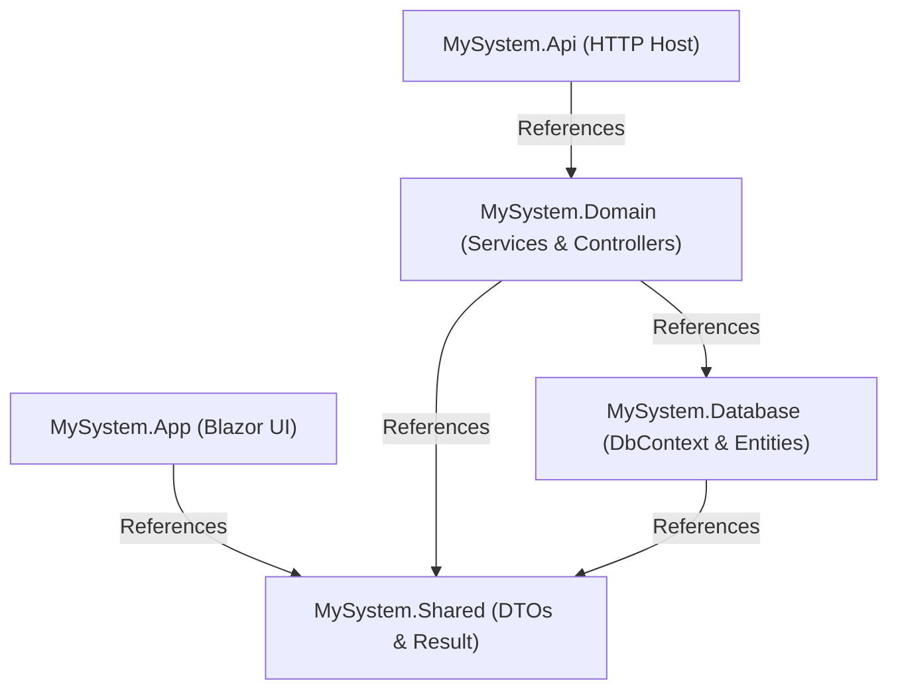

# Technical Framework Architecture Blueprint (.NET 10 & Blazor)

> **Purpose**: This document serves as a permanent, domain-agnostic technical specification and boilerplate guide. It documents the exact technical stack, architecture patterns, user control mechanisms, frontend/backend separation, security flows, and coding standards that must be strictly followed throughout the entire project lifecycle by both developers and AI agents.

---

## 1. Technical Stack Overview

| Tier / Component | Technology | Version / Tooling | Rationale & Characteristics |
|---|---|---|---|
| **Runtime & Language** | .NET 10.0 / C# 14 | SDK `10.0.x` | Latest enterprise C# features, enhanced performance, nullable reference types, records, pattern matching. |
| **Backend API Host** | ASP.NET Core Web API | `net10.0` | Minimal middleware pipeline, OpenTelemetry tracing, OpenAPI/Swagger, centralized exception interceptors. |
| **Frontend UI** | Blazor Web App | `InteractiveServer` | Real-time stateful UI without client-side bundle bloat, direct C# code sharing with backend DTOs, SignalR connection. |
| **Styling & CSS** | Tailwind CSS | v3.x / PostCSS | Utility-first CSS compiled via npm build pipeline into `wwwroot/css/app.css` (no heavy third-party UI component libraries like MudBlazor/Radzen). |
| **Data Access Layer** | Entity Framework Core (Database-First) + Dapper | EF Core `10.x`, Dapper `2.x`, `Microsoft.Data.SqlClient` | Database-First scaffolding (`dotnet ef dbcontext scaffold`) for complex relational schemas; Dapper for high-speed permission and auth checks. |
| **Database Engines** | Microsoft SQL Server | 2019 / 2022 / Azure SQL | Relational database with EF Core InMemory database fallback for developer testing and local demos. |
| **Authentication & Tokens** | JWT (JSON Web Tokens) & ASP.NET Core Cookie Auth | `JwtBearer` + `BCrypt.Net-Next` | Stateless backend API secured with HMAC-SHA256 / RSA JWT tokens; Blazor frontend secured with `HttpOnly`, `SameSite=Lax` cookie tickets storing the JWT securely on the server. |
| **Authorization** | Dynamic Database-Driven RBAC | Custom `IAuthorizationPolicyProvider` & `AuthorizationHandler` | Permissions evaluated per request in real-time against the database without waiting for token refresh or re-login. |
| **Design Patterns** | Result Pattern, Clean Layering, Dependency Injection | `Result<T>`, `PagedResult<T>`, Feature Slices | Zero business exceptions thrown in domain logic; all service operations return explicit success/failure status codes. |

---

## 2. Five-Layer Solution Architecture

The solution uses a strict 5-layer separation of concerns:

```
Solution Root (MySystem.sln)
├── src/
│   ├── MySystem.Shared/       [Class Library] -> Primitives, Result Pattern, DTOs, Permission Catalog
│   ├── MySystem.Database/     [Class Library] -> EF Core DbContext, Scaffolded Database Entities
│   ├── MySystem.Domain/       [Class Library] -> Business Services, Controllers, RBAC, Filters, Security
│   ├── MySystem.Api/          [Web API]       -> HTTP Pipeline Host, Middlewares, OpenAPI Specs
│   └── MySystem.App/          [Blazor Server] -> Tailwind UI, Razor Pages, HTTP API Clients, Cookie Auth
└── tests/
    ├── MySystem.Api.Tests/    [xUnit]         -> WebApplicationFactory, Dynamic RBAC, Security Contract Tests
    └── MySystem.App.Tests/    [xUnit]         -> Bunit Razor Component Tests, Route Migration Tests
```

### Layer Dependency Diagram



---

## 3. Backend Technical Details

### 3.1. Result Pattern (Zero-Exception Control Flow)
Instead of throwing exceptions for business validation failures, all domain and data operations return `Result<T>` or `PagedResult<T>`.

```csharp
// MySystem.Shared/Result.cs
public enum ResultStatus { Ok, BadRequest, Unauthorized, Forbidden, NotFound, Conflict, Error }

public class Result<T>
{
    public bool IsSuccess { get; init; }
    public T? Data { get; init; }
    public string? Message { get; init; }
    public ResultStatus Status { get; init; }

    public static Result<T> Success(T data, string? message = null) 
        => new() { IsSuccess = true, Data = data, Message = message, Status = ResultStatus.Ok };

    public static Result<T> Failure(string message, ResultStatus status = ResultStatus.BadRequest) 
        => new() { IsSuccess = false, Message = message, Status = status };
}
```

### 3.2. Base API Controller
Translates `Result<T>` directly into standard HTTP status codes:
```csharp
// MySystem.Shared/BaseController.cs
[ApiController]
public abstract class BaseController : ControllerBase
{
    protected IActionResult ToActionResult<T>(Result<T> result) => result.Status switch
    {
        ResultStatus.Ok => Ok(result),
        ResultStatus.BadRequest => BadRequest(result),
        ResultStatus.Unauthorized => Unauthorized(result),
        ResultStatus.Forbidden => StatusCode(StatusCodes.Status403Forbidden, result),
        ResultStatus.NotFound => NotFound(result),
        ResultStatus.Conflict => Conflict(result),
        _ => StatusCode(StatusCodes.Status500InternalServerError, result)
    };
}
```

### 3.3. Database Access Strategy (Database-First)
1. Pre-existing SQL Server tables are maintained via SQL migration scripts (`docs/Database/`).
2. EF Core CLI generates entity classes and `AppDbContext`:
   ```powershell
   dotnet ef dbcontext scaffold "Server=...;Database=...;..." Microsoft.EntityFrameworkCore.SqlServer -o AppDbContextModels --context AppDbContext
   ```
3. Dynamic In-Memory Fallback: If `ConnectionStrings:DefaultConnection` is empty or missing, DI registers `options.UseInMemoryDatabase("FallbackDb")` so local development and unit tests execute with zero database infrastructure overhead.

### 3.4. Middleware Pipeline (`MySystem.Api`)
* **`ExceptionHandlingMiddleware`**: Intercepts any unhandled server exceptions, logs stack trace, and writes a normalized JSON `Result<object>` with HTTP 500.
* **`ApiRequestLoggingMiddleware`**: Captures request route, HTTP verb, user identity, IP address, status code, and latency in milliseconds.
* **`PasswordChangeRequirementMiddleware`**: Inspects authenticated user claims. If `MustChangePassword == true`, blocks all non-whitelisted API calls with HTTP 403 (`PASSWORD_CHANGE_REQUIRED`).

---

## 4. Frontend Technical Details (Blazor Server + Tailwind)

### 4.1. Rendering & State Model
* Uses **Blazor Interactive Server** (`App.razor` with `@rendermode InteractiveServer`).
* Fast server-side execution with bidirectional WebSocket (SignalR) connection to the browser.
* State persists in memory on the server during the user session.

### 4.2. Secure Token Storage (No Browser LocalStorage)
To eliminate XSS token theft risks:
1. User submits login credentials on the Blazor form.
2. The Blazor server calls the Backend API `auth/login` and receives the JWT access token.
3. The Blazor server issues an encrypted, `HttpOnly`, `SameSite=Lax` cookie ticket (`Ace.Auth.Cookie`).
4. The JWT is embedded inside the server-side cookie claims ticket. Browser JavaScript cannot access the JWT.
5. Outgoing API requests from Blazor use `IHttpClientFactory` with a delegating handler or scoped client that injects `Authorization: Bearer <jwt>` from `IHttpContextAccessor`.

### 4.3. Tailwind CSS Build Pipeline
Tailwind is integrated directly into the Blazor project without node runtime dependencies in production:
* `package.json`:
  ```json
  {
    "scripts": {
      "build:css": "tailwindcss -i ./Styles/app.css -o ./wwwroot/css/app.css --minify",
      "watch:css": "tailwindcss -i ./Styles/app.css -o ./wwwroot/css/app.css --watch"
    },
    "devDependencies": {
      "tailwindcss": "^3.4.0",
      "postcss": "^8.4.0",
      "autoprefixer": "^10.4.0"
    }
  }
  ```
* `tailwind.config.js` content scanner:
  ```javascript
  module.exports = {
    content: ["./Components/**/*.{razor,html}", "./Pages/**/*.{razor,html}"],
    darkMode: 'class',
    theme: { extend: {} },
    plugins: []
  };
  ```

### 4.4. UI Component Patterns
* **`MainLayout.razor`**: Top navigation header, collapsible sidebar navigation menu, active user profile pill, and live SignalR reconnect modal.
* **`WorkflowWorkspace.razor` / Generic Workspace**: Reusable data layout providing search filtering, paginated grid, detail preview drawer, action toolbar, and audit timeline.
* **`ToastService.cs`**: Scoped service to display non-blocking success, error, and info toast notifications across components.

---

## 5. Security & User Control Architecture

### 5.1. Dynamic Database-Driven RBAC Engine
The system does not hardcode roles or permissions into attributes. Authorization is relational and real-time:

```
[User: TblAdminUser] 
   └── [Role: TblRole] (e.g., ADMIN, MAKER, CHECKER, SUPERVISOR)
         └── [Map: TblRolePermission]
               └── [Permission: TblPermission] (e.g., USER.CREATE, WORKFLOW.APPROVE)
```

#### Permission Catalog Contract (`MySystem.Shared/Security/PermissionCatalog.cs`)
```csharp
public sealed record PermissionDefinition(string Code, string Name, string Module, string? RoutePath);

public static class PermissionCatalog
{
    public const string UserView = "ADMIN.USER.VIEW";
    public const string UserCreate = "ADMIN.USER.CREATE";
    public const string RbacManage = "ADMIN.RBAC.MANAGE";
    // Define all module permissions here...
}
```

#### Real-Time Database Permission Evaluator (`IPermissionEvaluator`)
```csharp
public class PermissionEvaluator(AppDbContext dbContext, ICurrentUserContext currentUser) : IPermissionEvaluator
{
    public async Task<bool> HasPermissionAsync(string permissionCode, CancellationToken ct = default)
    {
        if (currentUser.RoleId == null) return false;
        
        // Immediate query to DB ensures instant revocation without token expiry delay
        return await dbContext.TblRolePermissions
            .AnyAsync(rp => rp.RoleId == currentUser.RoleId && 
                            rp.Permission.Code == permissionCode && 
                            rp.IsActive, ct);
    }
}
```

#### Custom Authorization Policy Provider
* Any endpoint or Razor page decorated with `[Authorize(Policy = "Permission:ADMIN.USER.CREATE")]` automatically delegates to the `PermissionAuthorizationHandler`, checking live database permissions.

### 5.2. Password Policy & Account Security Engine
* **Hashing**: `BCrypt.Net-Next` with work factor 12.
* **Complexity Rules**: Configurable minimum length, uppercase, lowercase, numeric digits, and special characters.
* **Password History**: Stores cryptographic hashes of previous passwords; prevents reusing the last $N$ passwords.
* **Brute-Force Protection**: Tracks `FailedLoginAttempts`. Locks account for $M$ minutes after reaching max failed attempts.
* **Password Expiry**: Enforces mandatory password change every $X$ days (`PasswordChangedAtUtc`).
* **First-Login Change Enforcement**: Flags `MustChangePassword = true` for newly provisioned accounts.

---

## 6. Configuration & Multi-Environment Management

The framework supports multi-stage environment configurations without code changes:

* `Config/custom-settings-dev.json` (Local Developer machine)
* `Config/custom-settings-staging.json` (Staging UAT)
* `Config/custom-settings-prod.json` (Production)

Strongly-typed binding via `CustomSettingModel.cs`:
```csharp
public sealed class CustomSettingModel
{
    public ConnectionStringsSettings ConnectionStrings { get; set; } = new();
    public JwtSettings Jwt { get; set; } = new();
    public SecuritySettings Security { get; set; } = new();
}
```

---

## 7. Step-by-Step Blueprint: Building a New Project on this Frame

Follow these steps in PowerShell or Bash to create a new solution from scratch using this exact frame:

### Step 1: Solution & Project Initialization
```powershell
# 1. Create root solution
dotnet new sln -n EnterpriseApp

# 2. Create the 5 core projects
dotnet new classlib -o src/EnterpriseApp.Shared -f net10.0
dotnet new classlib -o src/EnterpriseApp.Database -f net10.0
dotnet new classlib -o src/EnterpriseApp.Domain -f net10.0
dotnet new webapi -o src/EnterpriseApp.Api -f net10.0
dotnet new blazor -o src/EnterpriseApp.App -f net10.0 --interactivity Server

# 3. Add projects to solution
dotnet sln EnterpriseApp.sln add src/EnterpriseApp.Shared/EnterpriseApp.Shared.csproj
dotnet sln EnterpriseApp.sln add src/EnterpriseApp.Database/EnterpriseApp.Database.csproj
dotnet sln EnterpriseApp.sln add src/EnterpriseApp.Domain/EnterpriseApp.Domain.csproj
dotnet sln EnterpriseApp.sln add src/EnterpriseApp.Api/EnterpriseApp.Api.csproj
dotnet sln EnterpriseApp.sln add src/EnterpriseApp.App/EnterpriseApp.App.csproj
```

### Step 2: Establish References
```powershell
# Database references Shared
dotnet add src/EnterpriseApp.Database/EnterpriseApp.Database.csproj reference src/EnterpriseApp.Shared/EnterpriseApp.Shared.csproj

# Domain references Database & Shared
dotnet add src/EnterpriseApp.Domain/EnterpriseApp.Domain.csproj reference src/EnterpriseApp.Database/EnterpriseApp.Database.csproj
dotnet add src/EnterpriseApp.Domain/EnterpriseApp.Domain.csproj reference src/EnterpriseApp.Shared/EnterpriseApp.Shared.csproj

# Api references Domain
dotnet add src/EnterpriseApp.Api/EnterpriseApp.Api.csproj reference src/EnterpriseApp.Domain/EnterpriseApp.Domain.csproj

# App (Blazor) references Shared
dotnet add src/EnterpriseApp.App/EnterpriseApp.App.csproj reference src/EnterpriseApp.Shared/EnterpriseApp.Shared.csproj
```

### Step 3: Install NuGet Packages
```powershell
# Database layer
dotnet add src/EnterpriseApp.Database/EnterpriseApp.Database.csproj package Microsoft.EntityFrameworkCore
dotnet add src/EnterpriseApp.Database/EnterpriseApp.Database.csproj package Microsoft.EntityFrameworkCore.SqlServer
dotnet add src/EnterpriseApp.Database/EnterpriseApp.Database.csproj package Microsoft.EntityFrameworkCore.InMemory

# Domain layer
dotnet add src/EnterpriseApp.Domain/EnterpriseApp.Domain.csproj package Dapper
dotnet add src/EnterpriseApp.Domain/EnterpriseApp.Domain.csproj package BCrypt.Net-Next
dotnet add src/EnterpriseApp.Domain/EnterpriseApp.Domain.csproj package Microsoft.AspNetCore.Authentication.JwtBearer

# Api layer
dotnet add src/EnterpriseApp.Api/EnterpriseApp.Api.csproj package Microsoft.AspNetCore.OpenApi
dotnet add src/EnterpriseApp.Api/EnterpriseApp.Api.csproj package Swashbuckle.AspNetCore
```

### Step 4: Setup Tailwind CSS in `src/EnterpriseApp.App`
```powershell
cd src/EnterpriseApp.App
npm init -y
npm install -D tailwindcss postcss autoprefixer
npx tailwindcss init -p
```
Configure `tailwind.config.js` to scan `.razor` and `.html` files, add `@tailwind` directives to `Styles/app.css`, and compile to `wwwroot/css/app.css`.

---

## 8. Summary Checklist for Any New Domain

When adapting this frame to your new domain:
1. **Define Database Schemas**: Create tables with primary keys, foreign keys, `CreatedAtUtc`, and `RowVersion` for concurrency.
2. **Scaffold DbContext**: Run `dotnet ef dbcontext scaffold` into `MyProject.Database/AppDbContextModels`.
3. **Populate `PermissionCatalog.cs`**: Add permission constants for your new domain features.
4. **Implement Vertical Slices in `MyProject.Domain`**:
   * `Features/{FeatureName}/{FeatureName}Controller.cs`
   * `Features/{FeatureName}/{FeatureName}Service.cs`
   * `Features/{FeatureName}/{FeatureName}Models.cs` (in Shared)
5. **Create Blazor Pages in `MyProject.App`**:
   * Add dedicated `.razor` pages for each user workflow.
   * Decorate pages with `@attribute [Authorize(Policy = "Permission:MY_PERMISSION")]`.
   * Use `WorkflowWorkspace.razor` or tailored grid layouts styled with Tailwind CSS.